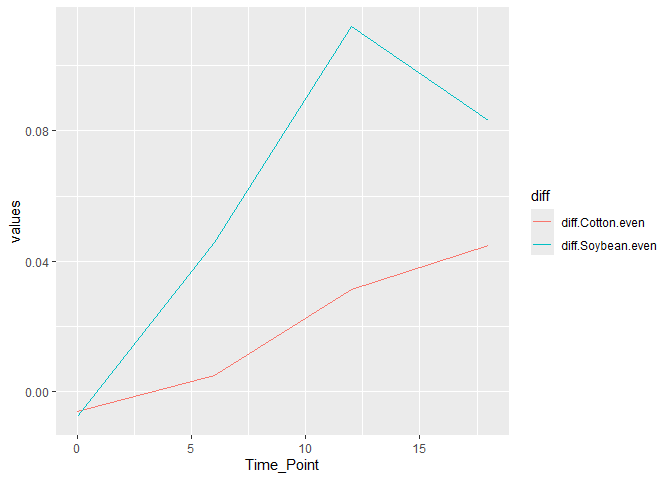

- [GitHub link](#github-link)
- [loading necessary package](#loading-necessary-package)
- [1. import two data files](#import-two-data-files)
- [2. Join the two dataframes together by the common
  column.](#join-the-two-dataframes-together-by-the-common-column.)
- [3. Calculate Pielou’s evenness
  index](#calculate-pielous-evenness-index)
- [4. Mean and standard error evenness grouped by crop over
  time](#mean-and-standard-error-evenness-grouped-by-crop-over-time)
- [5. Calculate the difference between the
  columns](#calculate-the-difference-between-the-columns)
- [6. Plotting](#plotting)

### [GitHub link](https://github.com/Prasanna-cb/PLPA6820/tree/main/Coding_chalange_5)

### loading necessary package

``` r
library(tidyverse)
```

### 1. import two data files

``` r
Metadata=read.csv ("Metadata.csv", na.strings = "na")
head(Metadata)
```

    ##     Code Crop Time_Point Replicate Water_Imbibed
    ## 1 S01_13 Soil          0         1            NA
    ## 2 S02_16 Soil          0         2            NA
    ## 3 S03_19 Soil          0         3            NA
    ## 4 S04_22 Soil          0         4            NA
    ## 5 S05_25 Soil          0         5            NA
    ## 6 S06_28 Soil          0         6            NA

``` r
DiversityData= read.csv ("DiversityData.csv", na.strings = "na")
str(DiversityData)
```

    ## 'data.frame':    70 obs. of  5 variables:
    ##  $ Code      : chr  "S01_13" "S02_16" "S03_19" "S04_22" ...
    ##  $ shannon   : num  6.62 6.61 6.66 6.66 6.61 ...
    ##  $ invsimpson: num  211 207 213 205 200 ...
    ##  $ simpson   : num  0.995 0.995 0.995 0.995 0.995 ...
    ##  $ richness  : int  3319 3079 3935 3922 3196 3481 3250 3170 3657 3177 ...

### 2. Join the two dataframes together by the common column.

``` r
alpha <- left_join(Metadata, DiversityData, by = "Code")
str(alpha)
```

    ## 'data.frame':    70 obs. of  9 variables:
    ##  $ Code         : chr  "S01_13" "S02_16" "S03_19" "S04_22" ...
    ##  $ Crop         : chr  "Soil" "Soil" "Soil" "Soil" ...
    ##  $ Time_Point   : int  0 0 0 0 0 0 6 6 6 6 ...
    ##  $ Replicate    : int  1 2 3 4 5 6 1 2 3 4 ...
    ##  $ Water_Imbibed: num  NA NA NA NA NA NA NA NA NA NA ...
    ##  $ shannon      : num  6.62 6.61 6.66 6.66 6.61 ...
    ##  $ invsimpson   : num  211 207 213 205 200 ...
    ##  $ simpson      : num  0.995 0.995 0.995 0.995 0.995 ...
    ##  $ richness     : int  3319 3079 3935 3922 3196 3481 3250 3170 3657 3177 ...

### 3. Calculate Pielou’s evenness index

``` r
alpha_even <- alpha %>%
  mutate(pielou_evenness = shannon / log(richness))
str(alpha_even)
```

    ## 'data.frame':    70 obs. of  10 variables:
    ##  $ Code           : chr  "S01_13" "S02_16" "S03_19" "S04_22" ...
    ##  $ Crop           : chr  "Soil" "Soil" "Soil" "Soil" ...
    ##  $ Time_Point     : int  0 0 0 0 0 0 6 6 6 6 ...
    ##  $ Replicate      : int  1 2 3 4 5 6 1 2 3 4 ...
    ##  $ Water_Imbibed  : num  NA NA NA NA NA NA NA NA NA NA ...
    ##  $ shannon        : num  6.62 6.61 6.66 6.66 6.61 ...
    ##  $ invsimpson     : num  211 207 213 205 200 ...
    ##  $ simpson        : num  0.995 0.995 0.995 0.995 0.995 ...
    ##  $ richness       : int  3319 3079 3935 3922 3196 3481 3250 3170 3657 3177 ...
    ##  $ pielou_evenness: num  0.817 0.823 0.805 0.805 0.819 ...

### 4. Mean and standard error evenness grouped by crop over time

``` r
alpha_even %>%
  group_by(Crop, Time_Point) %>% 
  summarise(mean_even = mean(pielou_evenness), 
            n = n(), 
            sd_dev = sd(pielou_evenness)) %>%
  mutate(std_err = sd_dev/sqrt(n)) -> alpha_avarage
```

    ## `summarise()` has grouped output by 'Crop'. You can override using the
    ## `.groups` argument.

``` r
 str(alpha_avarage)
```

    ## gropd_df [12 × 6] (S3: grouped_df/tbl_df/tbl/data.frame)
    ##  $ Crop      : chr [1:12] "Cotton" "Cotton" "Cotton" "Cotton" ...
    ##  $ Time_Point: int [1:12] 0 6 12 18 0 6 12 18 0 6 ...
    ##  $ mean_even : num [1:12] 0.82 0.805 0.767 0.755 0.814 ...
    ##  $ n         : int [1:12] 6 6 6 5 6 6 6 5 6 6 ...
    ##  $ sd_dev    : num [1:12] 0.00556 0.0092 0.01567 0.01689 0.00765 ...
    ##  $ std_err   : num [1:12] 0.00227 0.00376 0.0064 0.00755 0.00312 ...
    ##  - attr(*, "groups")= tibble [3 × 2] (S3: tbl_df/tbl/data.frame)
    ##   ..$ Crop : chr [1:3] "Cotton" "Soil" "Soybean"
    ##   ..$ .rows: list<int> [1:3] 
    ##   .. ..$ : int [1:4] 1 2 3 4
    ##   .. ..$ : int [1:4] 5 6 7 8
    ##   .. ..$ : int [1:4] 9 10 11 12
    ##   .. ..@ ptype: int(0) 
    ##   ..- attr(*, ".drop")= logi TRUE

### 5. Calculate the difference between the columns

``` r
alpha_avarage %>%
  select(Time_Point, Crop, mean_even) %>% #Time_Point, Crop, and mean.even #
  pivot_wider(names_from = Crop, values_from = mean_even)%>% 
  mutate(diff.Cotton.even = Soil - Cotton,diff.Soybean.even = Soil - Soybean)->alpha_average2
  str(alpha_average2)         
```

    ## tibble [4 × 6] (S3: tbl_df/tbl/data.frame)
    ##  $ Time_Point       : int [1:4] 0 6 12 18
    ##  $ Cotton           : num [1:4] 0.82 0.805 0.767 0.755
    ##  $ Soil             : num [1:4] 0.814 0.81 0.798 0.8
    ##  $ Soybean          : num [1:4] 0.822 0.764 0.687 0.716
    ##  $ diff.Cotton.even : num [1:4] -0.00602 0.00507 0.03129 0.0449
    ##  $ diff.Soybean.even: num [1:4] -0.0074 0.0459 0.1119 0.0833

### 6. Plotting

``` r
alpha_average2 %>%
  select(Time_Point, diff.Cotton.even, diff.Soybean.even) %>%
  pivot_longer(
    cols = c(diff.Cotton.even, diff.Soybean.even),
    names_to = "diff",
    values_to = "values"
  ) %>%
  ggplot(aes(x = Time_Point, y = values, color = diff)) +
  geom_line()
```

<!-- -->
